# ER — データモデル（テーブル構成）

現在の DB スキーマの ER 図とテーブル定義。**モデル（SQLAlchemy）とマイグレーションが
正本**で、本書はそれを読み手向けに図示したもの。

> **更新ルール**: テーブル・カラム・リレーション・制約を変更したとき
> （モデルの変更と Alembic マイグレーションの追加）は、**同じコミットでこのファイルを
> 更新する**。新しいテーブルは「ER 図」と「テーブル定義」の両方に追記する。

正本の場所:

| 対象 | 場所 |
|---|---|
| 共有テーブルのモデル | `shared/infrastructure/models/` |
| コンテキスト固有テーブルのモデル | `bounded_contexts/<context>/infrastructure/` |
| DDL（適用順） | `migrations/versions/` |
| マスタデータ（ロール・権限・初期管理者）の値 | `shared/domain/auth/master_data.py` |

モデルとマイグレーションの乖離は
`tests/integration/test_migration_model_consistency.py` が検出する。

---

## ER 図

```mermaid
erDiagram
    users ||--o{ user_roles : "所属する"
    roles ||--o{ user_roles : "割り当てられる"
    roles ||--o{ role_permissions : "持つ"
    permissions ||--o{ role_permissions : "付与される"
    users ||--o{ password_reset_tokens : "発行する"
    users ||--o| totp_secrets : "登録する"
    users ||--o{ passkey_credentials : "登録する"
    users ||--o{ webauthn_challenges : "発行する（ログイン用は NULL）"

    users {
        bigint id PK
        varchar(255) email UK "一意"
        varchar(100) username
        varchar(255) password_hash
        boolean is_active "既定 true"
        datetime created_at "UTC"
        datetime updated_at "UTC"
    }

    roles {
        bigint id PK
        varchar(50) name UK "admin / manager / member / guest"
    }

    permissions {
        bigint id PK
        varchar(100) code UK "scope（例: user:manage）"
    }

    user_roles {
        bigint user_id PK,FK
        bigint role_id PK,FK
    }

    role_permissions {
        bigint role_id PK,FK
        bigint permission_id PK,FK
    }

    password_reset_tokens {
        bigint id PK
        bigint user_id FK "索引あり"
        varchar(64) token_hash UK "ハッシュのみ保存"
        datetime expires_at
        datetime used_at "使用済みなら非 NULL"
        datetime created_at
    }

    totp_secrets {
        bigint user_id PK,FK "ユーザー 1 人につき 1 行"
        varchar(64) secret
        datetime confirmed_at "NULL = 登録手続き中"
        datetime created_at
        datetime updated_at
    }

    passkey_credentials {
        bigint id PK
        bigint user_id FK "索引あり"
        varchar(255) credential_id UK "base64url"
        text public_key
        bigint sign_count "既定 0"
        json transports
        varchar(100) name
        varchar(64) attestation_format
        varchar(64) aaguid
        boolean backup_eligible "既定 false"
        boolean backup_state "既定 false"
        datetime last_used_at
        datetime created_at
        datetime updated_at
    }

    webauthn_challenges {
        varchar(32) challenge_id PK
        varchar(255) challenge
        varchar purpose "registration / authentication（CHECK 付き）"
        bigint user_id FK "ログイン用は NULL"
        datetime expires_at "索引あり"
        datetime created_at
    }

    system_settings {
        varchar(100) setting_key PK
        json setting_json
        datetime updated_at
    }

    log {
        bigint id PK
        datetime created_at "索引あり・UTC"
        varchar(20) level "索引あり"
        varchar(120) logger "索引あり"
        text message
        varchar(36) request_id "索引あり"
        varchar(64) user_id_hash "索引あり・PII を持たないためハッシュのみ"
        varchar(255) path
        varchar(10) method
        int status_code
        int duration_ms
        text trace "例外時のみ"
    }

    audit_log {
        bigint id PK
        datetime occurred_at "索引あり・UTC"
        varchar(64) event_type "索引あり（例: login.failed）"
        varchar result "索引あり・success / failure（CHECK 付き）"
        bigint actor_user_id "索引あり・FK は張らない。未認証の失敗は NULL"
        varchar(64) target_type "索引あり・user / role / system_setting 等"
        varchar(64) target_id "対象の内部 ID"
        varchar(45) ip_address
        varchar(512) user_agent
        varchar(255) reason "失敗の分類・変更した項目名（値は入れない）"
        varchar(36) request_id "索引あり・log.request_id と同じ値"
    }

    items {
        bigint id PK
        varchar(255) name
    }
```

`system_settings` / `log` / `audit_log` / `items` は他テーブルと FK で結ばれない（意図的）。

- `log` はユーザーへ FK を張らない。PII を持たず `user_id_hash` だけを記録する方針のため
  （CLAUDE.md「ログ」）。ユーザーを消してもログは残る。
- `audit_log` も FK を張らない。追記専用の記録で、ユーザーを削除しても「誰が何をしたか」の
  行を残さなければならないため（ADR-0013）。`actor_user_id` は `users.id` と同じ値だが
  参照整合は取らない。
- `log.request_id` と `audit_log.request_id` は同じ値が入る。片方で見つけた ID をもう一方の
  絞り込みに入れると、1 リクエストの記録を両側から突き合わせられる。
- `system_settings` は設定キーごとの上書き値を持つ独立テーブル。
- `items` は `bounded_contexts/example`（新機能追加の見本）のテーブル。

---

## テーブル定義

### 認証・認可（`shared/infrastructure/models/`）

| テーブル | 役割 | モデル |
|---|---|---|
| `users` | ユーザー。`email` が一意な識別子。無効化は削除ではなく `is_active` で行う | `user.py` |
| `roles` | ロール。`id` は `user_roles` からの参照キーとして固定値で投入する | `role.py` |
| `permissions` | 権限コード（scope）。`code` を安定キーとし `id` は DB 採番 | `role.py` |
| `user_roles` | ユーザー ⇔ ロール（多対多） | `user.py` |
| `role_permissions` | ロール ⇔ 権限（多対多） | `role.py` |
| `password_reset_tokens` | パスワード再設定トークン。平文は保存せずハッシュのみ | `user.py` |

保有権限は**ユーザーが持つ全ロールの権限の和集合**（`User.permission_codes`）。
実際に有効な scope はアクティブロールで決まり、ロールを 1 つ選んでいるあいだは
そのロール分だけになる（`User.permission_codes_of`。ADR-0017）。アクティブロールは
JWT のクレームでありテーブルには持たない（セッションごとの状態のため）。
認可はロール名ではなく scope で判定する（ADR-0002）。

### アカウントセキュリティ（`bounded_contexts/account_security/infrastructure/`）

| テーブル | 役割 |
|---|---|
| `totp_secrets` | TOTP 共有鍵。`user_id` が主キー（1 ユーザー 1 行）。`confirmed_at` が NULL のあいだは登録手続き中で二要素認証は未有効 |
| `passkey_credentials` | WebAuthn 資格情報。`credential_id`（base64url）で持ち主を引く。`sign_count` はリプレイ検知用 |
| `webauthn_challenges` | 発行済みチャレンジ。複数ワーカー構成でも検証できるようプロセスメモリではなく DB に置く。ログイン用は発行時点で相手が不明なため `user_id` が NULL |

`users.id` への FK は 3 つとも `ON DELETE CASCADE`（ユーザー削除で資格情報も消える）。
経緯は ADR-0003。

### 運用・その他

| テーブル | 役割 | モデル |
|---|---|---|
| `system_settings` | 設定の DB 上書き層。優先順位は 環境変数 > DB > デフォルト値 | `shared/infrastructure/models/system_setting.py` |
| `log` | アプリログ（システムが何をしたか）。`request_id` でリクエスト単位に追跡する。索引は絞り込み軸（レベル・ロガー・利用者・期間・`request_id`）に対応する | `shared/infrastructure/models/log.py` |
| `audit_log` | 監査ログ（誰が何をしたか）。ログイン・ユーザー／ロール管理・設定変更・再起動要求・MFA の変更を記録する | `bounded_contexts/audit/infrastructure/audit_log_model.py` |
| `items` | example コンテキストのサンプルテーブル | `bounded_contexts/example/infrastructure/item_model.py` |

`log` と `audit_log` の使い分け（ADR-0013）:

| | `log` | `audit_log` |
|---|---|---|
| 残すもの | システムが何をしたか（リクエスト・警告・例外） | 誰が何をしたか（操作と結果） |
| 書き手 | `shared/kernel/logging` の `DbLogHandler`（全レイヤーから） | audit コンテキストのユースケース（ルーターから明示的に） |
| 量・寿命 | 多い・短命（`LOG_DB_MIN_LEVEL` で間引ける） | 少ない・長命（間引かない） |
| 閲覧 scope | `log:view` | `audit:view` |

`audit_log.actor_user_id` は不可逆ハッシュではなく内部 ID を持つ。監査は操作を主体へ
帰属させるための記録で、後から誰か特定できなければ目的を果たさないため（ADR-0013）。
メールアドレス・ユーザー名・パスワード・設定値そのものは記録しない。

---

## モデリング規約

図と定義を読むときの前提。詳細は CLAUDE.md「DB モデリング」を参照。

- **DB ネイティブ ENUM を使わない。** `sa.Enum(..., native_enum=False)`（CHECK 付き
  VARCHAR）か、`String` + Python 側の許可値定数にする。
  例: `webauthn_challenges.purpose`（許可値は
  `CHALLENGE_PURPOSES` = `registration` / `authentication`）、
  `audit_log.result`（許可値は `AuditResult` = `success` / `failure`）。
  `audit_log.event_type` は素の `VARCHAR`（値が増え続けるため CHECK を付けない。
  許可値は `AuditEventType` で集中管理する）。
- **主キー等の `BigInteger`** は `sa.BigInteger().with_variant(sa.Integer(), "sqlite")`
  （`shared/infrastructure/models/base.py` の `BigIntPk`）。本番 MariaDB と
  テスト SQLite を両立させるため（ADR-0001）。
- **時刻は常に UTC**（naive datetime で保存）。生成は `shared/kernel/timestamps.utcnow`。
- **PII を保存しない列**は `*_hash` とする（`log.user_id_hash`、
  `password_reset_tokens.token_hash`）。監査ログのように「後から主体を特定できなければ
  意味がない」記録は例外で、内部 ID（`audit_log.actor_user_id`）を持つ。
  いずれの場合もメールアドレス・氏名・パスワード等の PII 自体は保存しない（ADR-0013）。

## テーブルを追加・変更するとき

1. モデルを追加・変更する（共有なら `shared/infrastructure/models/`、
   コンテキスト固有ならそのコンテキストの `infrastructure/`）。
2. 共有モデルは `shared/infrastructure/models/__init__.py` に、コンテキスト固有モデルは
   `migrations/env.py` と `tests/conftest.py` に import を追加する
   （Alembic とテストがメタデータを認識できるようにするため）。
3. Alembic マイグレーションを追加する（`upgrade()` / `downgrade()` の両方を実装）。
   `ALTER TABLE` / `CREATE TABLE` の直接実行は禁止。
4. **本書（`docs/ER.md`）の ER 図とテーブル定義を更新する。**
5. `uv run pytest tests/integration/test_migration_model_consistency.py` で乖離が
   無いことを確認する。
