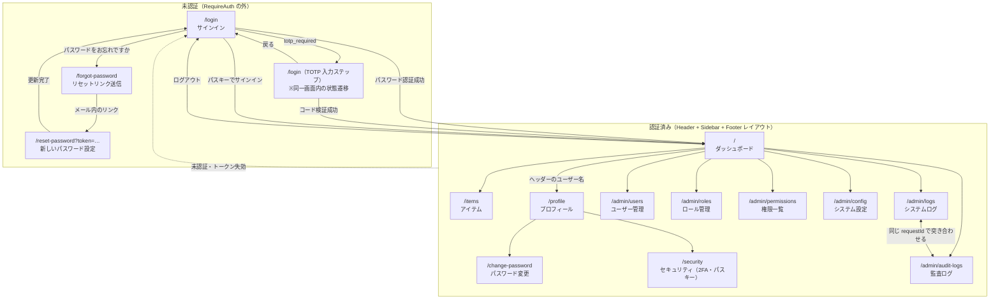

# frontend — 画面仕様・操作マニュアル

管理画面 SPA（React + TypeScript + Vite）の**画面遷移図・画面仕様・操作マニュアル**。

この文書は「画面が**現在どう動くか**」の仕様書である（役割分担は
[CLAUDE.md](../CLAUDE.md)「ドキュメントの役割分担」参照）。過去の不具合の経緯は
`docs/CHANGELOG.md`、設計判断は `docs/decisions/`（ADR）に書く。

> **更新ルール**: 画面の追加・削除、ルート（URL）の変更、遷移の変更、必要 scope の
> 変更、画面上の操作手順の変更を行ったときは、**同じコミットでこのファイルを更新する**。
> 新しい画面を追加するときは「画面遷移図」「画面一覧」「画面仕様」「操作マニュアル」の
> 4 か所すべてに追記する。

API のリクエスト・レスポンス仕様は手書きしない。Swagger UI（`/docs`）と
`/openapi.json` が唯一の出所で、本書は「どの画面がどのエンドポイントを使うか」だけを示す。

---

## 開発

```bash
npm install
npm run dev          # http://localhost:5173（/api は 8000 へプロキシ）
npm run build        # frontend/dist → FastAPI が / で配信
npm run test         # Vitest
```

パスキーを試すときは **`localhost`** で開く（`127.0.0.1` では WebAuthn の RP ID が
成立しない）。

---

## 画面遷移図



- サイドバーの項目は**ロール名ではなく scope** で出し入れする（`components/Sidebar.tsx`）。
- 未認証で認証必須ルートを開くと `/login` にリダイレクトされる（`RequireAuth`）。
- 未定義のパス（`*`）は `/` にリダイレクトされる。

---

## 画面一覧

| #   | 画面                   | ルート                    | 認証 | 必要 scope                                          | サイドバー |
| --- | ---------------------- | ------------------------- | ---- | --------------------------------------------------- | ---------- |
| S1  | サインイン             | `/login`                  | 不要 | —                                                   | —          |
| S2  | パスワードリセット申請 | `/forgot-password`        | 不要 | —                                                   | —          |
| S3  | パスワード再設定       | `/reset-password?token=…` | 不要 | —                                                   | —          |
| S4  | ダッシュボード         | `/`                       | 必要 | `dashboard:view`                                    | ✅         |
| S5  | アイテム               | `/items`                  | 必要 | `item:view`（追加は `item:manage`）                 | ✅         |
| S6  | プロフィール           | `/profile`                | 必要 | —                                                   | —          |
| S7  | パスワード変更         | `/change-password`        | 必要 | —                                                   | —          |
| S8  | セキュリティ           | `/security`               | 必要 | —                                                   | —          |
| S9  | ユーザー管理           | `/admin/users`            | 必要 | `user:manage`                                       | ✅         |
| S10 | ロール管理             | `/admin/roles`            | 必要 | `role:manage`                                       | ✅         |
| S11 | 権限一覧               | `/admin/permissions`      | 必要 | `permission:manage`                                 | ✅         |
| S12 | システム設定           | `/admin/config`           | 必要 | `admin:system-settings`（再起動は `system:manage`） | ✅         |
| S13 | システムログ           | `/admin/logs`             | 必要 | `log:view`                                          | ✅         |
| S14 | 監査ログ               | `/admin/audit-logs`       | 必要 | `audit:view`                                        | ✅         |

scope の一覧と各ロールへの割り当ての正本は `shared/domain/auth/master_data.py`。

---

## 画面仕様

各画面は「目的 / 表示内容 / 操作 / 使用 API / 備考」で書く。新しい画面もこの形に揃える。

### S1 サインイン（`/login`）

- **目的**: メールアドレスとパスワード、またはパスキーでサインインする。
- **表示内容**: メール、パスワード、サインインボタン、パスキーボタン
  （ブラウザが対応している場合のみ）、パスワードリセットへのリンク。
- **操作**:
  1. メール・パスワードを入力して送信 → 成功で `/` へ。
  2. 二要素認証が有効なユーザーは `totp_required` が返り、**同じ画面が
     ワンタイムコード入力ステップに切り替わる**（エラー表示ではなく次の手順）。
  3. コードを送信 → 成功で `/`。「戻る」で資格情報入力に戻る。
- **使用 API**: `POST /api/auth/login`, `POST /api/auth/passkey/challenge`,
  `POST /api/auth/passkey/login`
- **備考**: エラーはエラーコードで返り、文言は `src/i18n/*.json` の
  `error.*` キーで表示する（バックエンドは表示文言を返さない）。

### S2 パスワードリセット申請（`/forgot-password`）

- **目的**: 登録済みメールアドレスへ再設定リンクを送る。
- **操作**: メールを入力して送信 → 宛先の存在に関わらず同じ完了メッセージを表示する
  （アカウントの存在を漏らさないため）。
- **使用 API**: `POST /api/auth/forgot-password`

### S3 パスワード再設定（`/reset-password?token=…`）

- **目的**: メール内リンクのトークンで新しいパスワードを設定する。
- **操作**: 新しいパスワードを入力して送信 → 完了後 `/login` へ。
- **使用 API**: `POST /api/auth/reset-password`
- **備考**: トークンは失効・使用済みで拒否される（`error.invalid_or_expired_token`）。

### S4 ダッシュボード（`/`）

- **目的**: サインイン後の入口。
- **表示内容**: 見出しのみのスケルトン。プロジェクト固有のウィジェットを足す場所。
- **使用 API**: なし

### S5 アイテム（`/items`）

- **目的**: `bounded_contexts/example`（Item CRUD）の画面側の見本。
- **操作**: 一覧の表示、名前を入力して追加。
- **使用 API**: `GET /api/items`, `POST /api/items`

### S6 プロフィール（`/profile`）

- **目的**: サインイン中のユーザー自身の情報と有効 scope の確認。
- **表示内容**: ユーザー名・メール・付与されている scope の一覧。
- **操作**: パスワード変更（S7）・セキュリティ（S8）へ遷移。
- **使用 API**: `GET /api/auth/me`

### S7 パスワード変更（`/change-password`）

- **目的**: 現在のパスワードを確認して変更する。
- **使用 API**: `POST /api/auth/change-password`

### S8 セキュリティ（`/security`）

- **目的**: 二要素認証（TOTP）とパスキー（WebAuthn）の登録・解除。
- **表示内容**: 二要素認証の状態、登録時の QR コードと手入力用の鍵、
  登録済みパスキーの一覧（名前・登録日時・最終使用日時）。
- **操作**:
  - 二要素認証: 「設定」→ QR を認証アプリで読み取り → コードを入力して確定。
    解除は現在のコードの入力が必要。
  - パスキー: 名前を入れて「パスキーを追加」→ ブラウザの認証を実行 → 登録。
    一覧から削除。
- **使用 API**: `GET|POST /api/account/security/two-factor*`,
  `GET|POST|DELETE /api/account/security/passkeys*`
- **備考**: ブラウザが WebAuthn 非対応のときはパスキー欄に非対応メッセージを出す。

### S9 ユーザー管理（`/admin/users`）

- **目的**: ユーザーの追加（ロールを 1 つ選択）・有効/無効の切り替え・削除。
- **使用 API**: `GET|POST /api/admin/users`, `PUT|DELETE /api/admin/users/{id}`,
  `GET /api/admin/roles`

### S10 ロール管理（`/admin/roles`）

- **目的**: ロールの追加・削除と、ロールへの権限（scope）割り当て。
- **使用 API**: `GET|POST /api/admin/roles`, `PUT|DELETE /api/admin/roles/{id}`,
  `GET /api/admin/permissions`

### S11 権限一覧（`/admin/permissions`）

- **目的**: 定義済み権限コード（scope）の確認。読み取り専用。
- **使用 API**: `GET /api/admin/permissions`

### S12 システム設定（`/admin/config`）

- **目的**: DB に保存する設定値をカテゴリ別に編集する。
- **表示内容**: カテゴリごとの設定項目。環境変数で固定されている項目は
  「環境変数で固定」と表示して編集不可、起動時のみ読まれる項目は
  「再起動後に反映」と表示する。
- **操作**: 値を編集して保存 → 再起動が必要な項目を含む場合は対象キーを示す
  メッセージと「今すぐ再起動」ボタンを出す。`system:manage` が無い場合は
  管理者への依頼メッセージを表示する。
- **使用 API**: `GET|PUT /api/admin/config`, `POST /api/admin/system/restart`
- **備考**: 項目の定義は `presentation/fastapi/admin/system_settings_definitions.py`。
  設定キーを追加するときは CLAUDE.md「設定管理」の 3 ファイルを更新する。

### S13 システムログ（`/admin/logs`）

- **目的**: `log` テーブル（アプリログ = **システムが何をしたか**）の検索・閲覧。
- **表示内容**: 時刻（UTC）・レベル・ロガー・メッセージ・`requestId`・パス・
  ステータス・所要時間。件数は「{総件数} 件中 {開始}〜{終了} 件」で示す。
  例外が記録された行は「traceback を表示」で本文の下に展開する。
- **操作**:
  1. 絞り込み条件（レベル／ロガーの前方一致／メッセージの部分一致／`requestId`／
     期間）を入れて「検索」。未入力の項目は条件に使われない。
  2. 「条件をクリア」で全条件を消す。
  3. 「前へ」「次へ」でページを送る（1 ページ 50 件、新しい順）。
- **使用 API**: `GET /api/admin/logs`, `GET /api/admin/logs/filters`
- **備考**:
  - ログに PII は含まれない。ユーザーの識別は `user.id_hash` のみ。
  - 期間の指定と時刻の表示はどちらも **UTC**（ブラウザのローカル時刻ではない）。
  - レベルの選択肢はバックエンドの `GET /api/admin/logs/filters` から取得する
    （画面に列挙を写さない）。
  - DB に書かれる下限レベルはシステム設定の `LOG_DB_MIN_LEVEL`。ここに出ないログは
    stdout 側には出ている可能性がある。

### S14 監査ログ（`/admin/audit-logs`）

- **目的**: `audit_log` テーブル（監査ログ = **誰が何をしたか**）の検索・閲覧。
  ログイン成否・ユーザー／ロール管理・システム設定変更・再起動要求・二要素認証と
  パスキーの変更が記録されている。
- **表示内容**: 時刻（UTC）・イベント・結果（success / failure）・実行者（ユーザー ID）・
  対象（`種別:ID`）・詳細・IP アドレス・`requestId`。
- **操作**:
  1. 絞り込み条件（イベント／結果／実行者のユーザー ID／対象の種別・ID／`requestId`／
     期間）を入れて「検索」。
  2. 「失敗だけ表示」で `result=failure` に一発で絞る（他の条件はクリアされる）。
  3. 「条件をクリア」で全条件を消す。「前へ」「次へ」でページを送る。
- **使用 API**: `GET /api/admin/audit-logs`, `GET /api/admin/audit-logs/filters`
- **備考**:
  - 実行者・対象は**内部 ID** で表示する。監査ログにメールアドレス等の PII を保存しない
    ため（`docs/decisions/ADR-0010-audit-log.md`）。ID から利用者を辿るときは
    ユーザー管理（S9）を見る。
  - 「詳細」列には失敗の分類（`invalid_password` 等）や変更した項目名
    （`fields=is_active`・`keys=LOG_LEVEL`）が入る。**値そのものは入らない**。
  - **「実行者」が入るのは認証済みの操作だけ。** ログイン失敗やパスワードリセットは
    誰が行ったか分からないため、相手のアカウントは「対象」列に出る（実行者は `—`）。
    あるアカウントに対する不審な操作を追うときは「対象の種別」＝`user` で絞る。
  - ログイン失敗の応答は理由を問わず同じ（`invalid_credentials`）。理由の内訳を
    見られるのはこの画面だけ。
  - ログアウトは記録されない（操作した利用者を特定できないため）。

### 共通レイアウト（Header / Sidebar / Footer）

- **Header**: アプリ名（`/` へ戻る）、言語切り替え、テーマ切り替え
  （ライト / ダーク / OS 追従）、ユーザー名（`/profile` へ）、ログアウト。
- **Sidebar**: S4〜S14 のうち、**保有 scope に合致する項目だけ**を表示する。
- **Footer**: バージョンと git SHA（`GET /info`）。
- 言語・テーマの初期値はサインイン前に `GET /api/ui/settings` から取得する。

---

## 操作マニュアル

「〇〇したいとき、どう操作するか」を利用者視点で書く。画面の操作を変えたら
ここも直す。

### サインインする

1. `/login` を開く。
2. メールアドレスとパスワードを入力して「サインイン」。
   - 初期管理者は `admin@example.com` / `admin@example.com`（初回サインイン後に必ず変更する）。
3. 二要素認証を有効にしている場合は、認証アプリのコードを入力して再度「サインイン」。
4. パスキーを登録済みなら「パスキーでサインイン」から画面ロック / セキュリティキーで入れる。

### パスワードを忘れたとき

1. `/login` の「パスワードをお忘れですか」を開く。
2. メールアドレスを入力して送信する。
3. 届いたメールのリンク（`/reset-password?token=…`）を開き、新しいパスワードを設定する。
4. `/login` に戻ってサインインする。

> メール送信が無効（`MAIL_ENABLED` が off）の環境ではリンクは届かない。その場合は
> `user:manage` を持つ管理者にパスワードの上書きを依頼する（画面には項目が無いため
> API から行う）。手順は `docs/OPERATIONS.md`「管理者がパスワードを忘れて
> サインインできないとき」を参照。投入スクリプトの再実行では復旧しない
> （既存ユーザーを変更しないため）。

### パスワードを変更したいとき

1. ヘッダーのユーザー名 → 「パスワード変更」。
2. 現在のパスワードと新しいパスワードを入力して「変更」。

### 二要素認証を有効にしたいとき

1. ヘッダーのユーザー名 → 「セキュリティ」。
2. 「二要素認証」の「設定」を押す。
3. 表示された QR コードを認証アプリで読み取る（読み取れない場合は表示された鍵を手入力）。
4. アプリに出た 6 桁のコードを入力して「確定」。
5. 解除するときは、同じ画面で現在のコードを入力して「無効にする」。

### パスキーを登録したいとき

1. 「セキュリティ」画面を開く（**`localhost` などのドメイン名でアクセスしていること**）。
2. 名前（例: `Work laptop`）を入れて「パスキーを追加」。
3. ブラウザの案内に従って画面ロックまたはセキュリティキーで承認する。
4. 一覧に追加される。不要になったら一覧から削除する。

### ユーザーを追加したいとき（`user:manage`）

1. サイドバーの「ユーザー」を開く。
2. メール・ユーザー名・パスワードを入力し、割り当てるロール（1 つ）を選んで「追加」。
3. 一時的に止めるときは一覧の「有効」を切り替える（削除ではなく無効化を推奨）。

### 権限を変えたいとき（`role:manage`）

1. サイドバーの「ロール」を開く。
2. 対象ロールの権限（scope）のチェックを変更する。ユーザー個別ではなく
   **ロールに対して**付与する。
3. 新しいロールが必要なら名前を入れて「追加」し、権限を割り当てる。

> 有効 scope はユーザーが持つ全ロールの権限の和集合。反映にはユーザーの
> 再サインイン（トークン再発行）が必要。

### システム設定を変えたいとき（`admin:system-settings`）

1. サイドバーの「システム設定」を開く。
2. 値を編集して「保存」。
3. 「再起動後に反映」と出た項目を変更した場合は「今すぐ再起動」を押す
   （`system:manage` が必要）。数秒後にアプリが復帰する。

> 「環境変数で固定」と表示されている項目は画面から変更できない。
> 優先順位は 環境変数 > DB > デフォルト値。

### エラーを調べたいとき（`log:view`）

1. サイドバーの「システムログ」を開く。
2. レベルに `ERROR` を選んで「検索」。期間を絞るなら開始・終了（**UTC**）も入れる。
3. 例外の行は「traceback を表示」で詳細を開く。
4. 原因を追うときは、その行の `requestId` を控えて手順を変える。
   - **同じリクエストの他のログ**を見る → `requestId` 欄に貼って「検索」。
   - **誰の操作だったか**を見る → 「監査ログ」画面の `requestId` 欄に貼って「検索」。

特定のモジュールだけ見たいときは「ロガー」に前方一致で入れる
（`app.request` = HTTP アクセスログ、`bounded_contexts` = 業務処理）。

> 画面に出ないログがある場合は、システム設定の `LOG_DB_MIN_LEVEL` が DB への
> 書き込みを間引いている。stdout 側（コンテナのログ）には出ている。

### 誰が何をしたかを調べたいとき（`audit:view`）

1. サイドバーの「監査ログ」を開く。
2. よく使う絞り込み:
   - **不審なログイン試行** → 「失敗だけ表示」を押す。イベントが `login.failed` の行の
     「詳細」に理由（`unknown_email` / `invalid_password` / `invalid_totp` 等）が出る。
   - **あるユーザーへの操作** → 「対象の種別」に `user`、「対象 ID」にユーザー ID を入れる。
     そのアカウントを狙ったログイン失敗・パスワードリセット要求もここに出る。
   - **ある管理者の操作** → 「実行者（ユーザー ID）」にその管理者のユーザー ID を入れる。
   - **設定を変えたのは誰か** → イベントに `system_settings.updated` を選ぶ。
     「詳細」に変更されたキー名が出る（値は出ない）。
3. ユーザー ID から人を特定するときは「ユーザー」画面（`user:manage` が必要）の
   一覧と突き合わせる。

> 監査ログには個人情報を保存しない。実行者・対象は内部 ID で表示され、パスワードや
> 設定値そのものは記録されない。

### 表示言語・テーマを変えたいとき

ヘッダーの言語セレクタ・テーマセレクタで切り替える（選択はブラウザに保存される）。
テーマは ライト / ダーク / OS 追従 の 3 つ。既定値はシステム設定の
`DEFAULT_LOCALE` / `DEFAULT_THEME`。

---

## ディレクトリ構成

```
src/
  App.tsx           # ルート定義と RequireAuth（画面を増やすときはここも）
  components/       # Header / Sidebar / Footer / ToastNotification
  pages/            # 画面 1 つ = 1 ファイル（*Page.tsx）
  services/         # api.ts（fetch + トークン更新）/ webauthn.ts / uiSettings.ts
  store/            # AuthContext（サインイン状態・scope 判定）
  i18n/             # 言語別 JSON（英語キーで定義し各言語へ訳す）
  theme/            # テーマ適用
  test-support/     # テスト用ヘルパー
```

新しい画面を追加するときの手順:

1. `src/pages/<Name>Page.tsx` を作る。
2. `src/App.tsx` にルートを追加する（認証が必要なら `RequireAuth` の中）。
3. サイドバーに出すなら `components/Sidebar.tsx` の `ITEMS` に
   **必要な scope 付きで**追加する。
4. 文言は `src/i18n/en.json` に英語キーで追加し、各言語ファイルへ訳を入れる。
5. **本 README の画面遷移図・画面一覧・画面仕様・操作マニュアルを更新する。**
6. `npm run test` と `make check-frontend` を通す。
